# PRD 예제 모음

실제 사용 가능한 완전한 PRD 예제 3가지 (하이브리드 구조 적용)

---

# 예제 1: 공지사항 게시판

> 관리자용 공지사항 게시판 관리 기능 (기본 CRUD + 파일)

---

# Part A: Visual Overview (사람용)

## 시스템 아키텍처

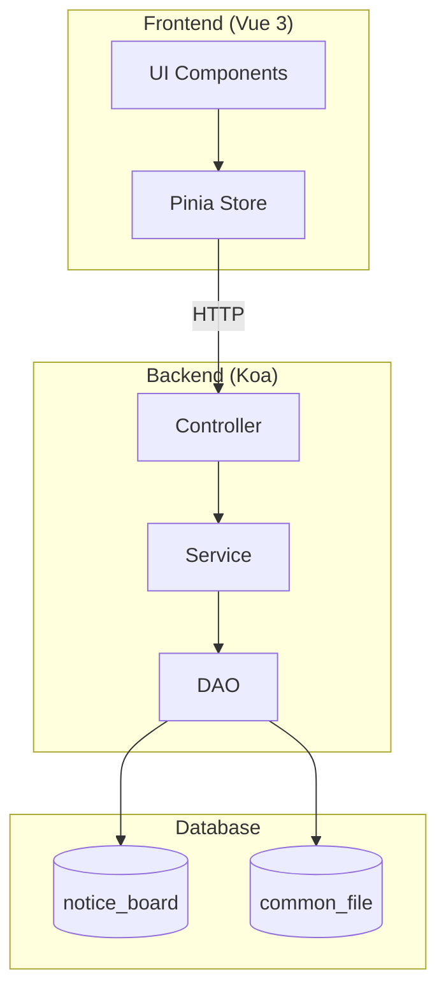

## 데이터 흐름

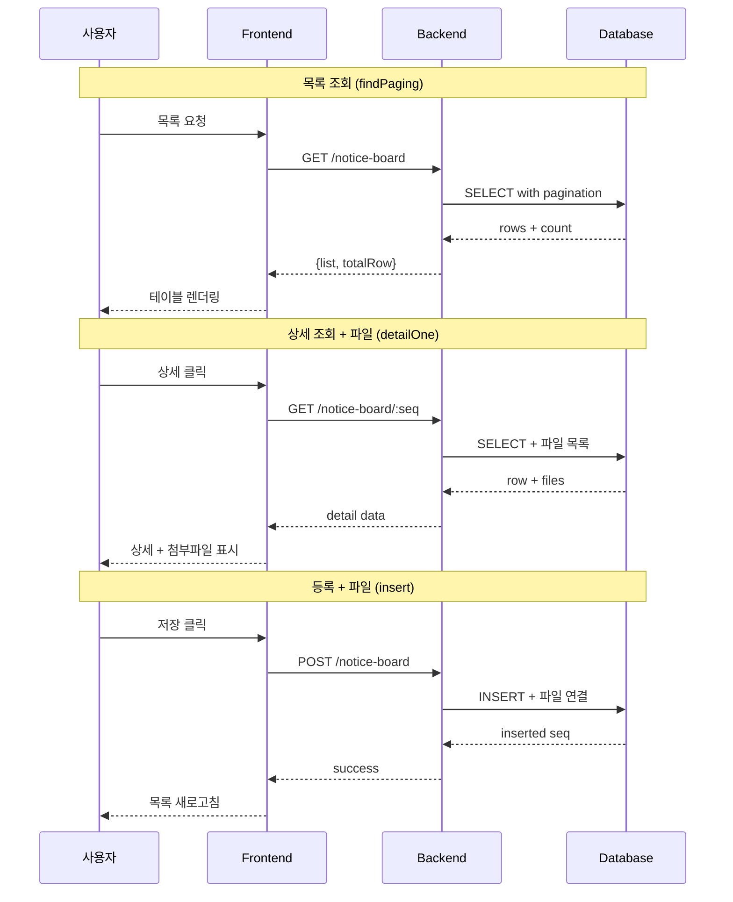

## UI 흐름도

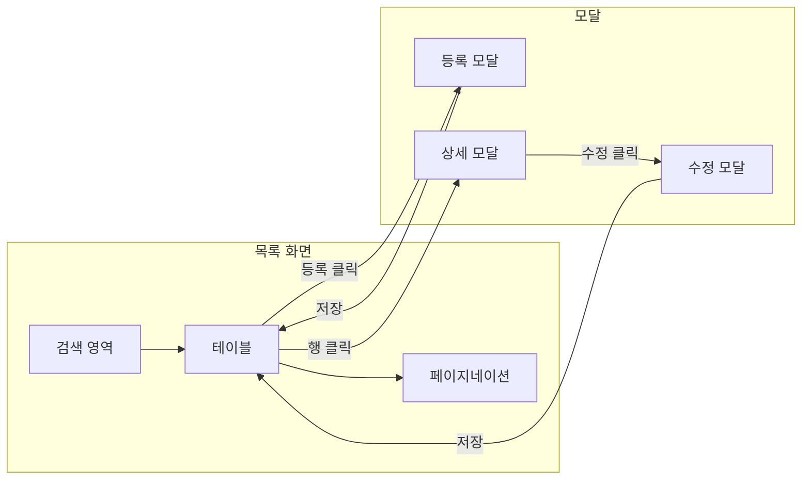

## ER 다이어그램

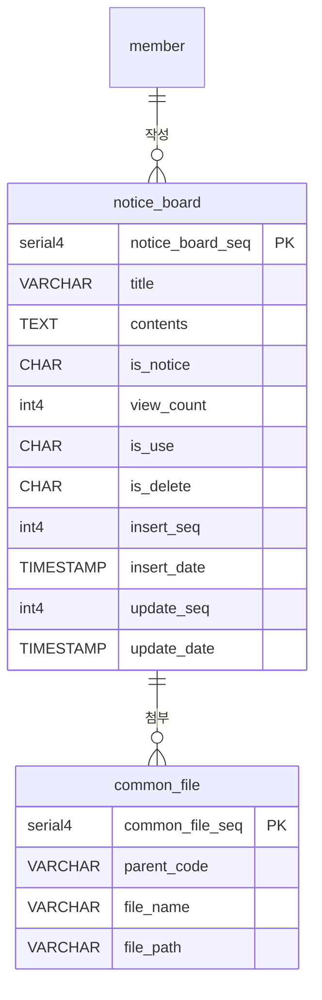

---

# Part B: Detailed Spec (AI용)

## 메타
- 모듈명: notice-board
- 테이블명: notice_board
- 한글 기능명: 공지사항-게시판
- 한줄 설명: 관리자용 공지사항 게시판 관리
- UI 패턴: crud (Modal)
- 파일 업로드: Y (일반 파일 + 이미지)
- 저장 방식: Local

---

## 1. 기능 범위

### CRUD 기능
| 기능 | 적용 | 메서드명 | 설명 |
|------|------|----------|------|
| 페이징 목록 | Y | findPaging | 페이지네이션 포함 목록 조회 |
| 키워드 검색 | Y | findList | Selectbox용 전체 목록 |
| 상세 조회 | Y | detailOne | 단건 상세 정보 + 파일 목록 |
| 등록 | Y | insert | 신규 데이터 생성 + 파일 연결 |
| 수정 | Y | update | 기존 데이터 수정 + 파일 재연결 |
| 사용여부 변경 | Y | updateUse | is_use 플래그 토글 |
| 논리 삭제 | Y | softDelete | is_delete='Y' 처리 + 파일 삭제 |

### 파일 기능
| 기능 | 적용 |
|------|------|
| 일반 파일 | Y |
| 이미지 | Y |
| 저장 방식 | Local |

---

## 2. UI 구성

### 패턴: 기본 CRUD (Modal)

### 화면 구성
- **목록 화면**:
  - 테이블 컬럼: 공지여부, 제목, 작성자, 작성일, 조회수, 사용여부, 관리
  - 검색 옵션: 키워드, 날짜 범위 (시작일-종료일), 사용여부 (전체/사용/미사용)
  - 페이지네이션: 20건씩
  - 버튼: [등록]

- **등록/수정 모달**:
  - 제목 (필수, 200자 이내)
  - 내용 (필수, Textarea)
  - 공지여부 (Y/N, 라디오 버튼)
  - 사용여부 (Y/N, 라디오 버튼)
  - 일반 파일 첨부 (다중, 최대 5개)
  - 이미지 첨부 (다중, 최대 3개)
  - 버튼: [취소] [저장]

- **검증**:
  - 제목: 필수, 200자 이내
  - 내용: 필수

---

## 3. DB 스키마

### 테이블: notice_board

#### PostgreSQL
| 컬럼 | 타입 | 필수 | 설명 | 선택값 | 기본값 |
|------|------|------|------|--------|--------|
| notice_board_seq | serial4 | Y | PK | - | 자동증가 |
| title | VARCHAR(200) | Y | 제목 | - | - |
| contents | TEXT | Y | 내용 | - | - |
| is_notice | CHAR(1) | Y | 공지여부 | Y:공지,N:일반 | N |
| view_count | int4 | Y | 조회수 | - | 0 |
| is_use | CHAR(1) | Y | 사용여부 | Y:사용,N:미사용 | Y |
| is_delete | CHAR(1) | Y | 삭제여부 | Y:삭제,N:정상 | N |
| insert_seq | int4 | Y | 등록자 | - | - |
| insert_date | TIMESTAMP | Y | 등록일 | - | - |
| update_seq | int4 | Y | 수정자 | - | - |
| update_date | TIMESTAMP | Y | 수정일 | - | - |

#### MySQL
| 컬럼 | 타입 | 필수 | 설명 | 선택값 | 기본값 |
|------|------|------|------|--------|--------|
| notice_board_seq | BIGINT | Y | PK | - | AUTO_INCREMENT |
| title | VARCHAR(200) | Y | 제목 | - | - |
| contents | TEXT | Y | 내용 | - | - |
| is_notice | CHAR(1) | Y | 공지여부 | Y:공지,N:일반 | N |
| view_count | INT | Y | 조회수 | - | 0 |
| is_use | CHAR(1) | Y | 사용여부 | Y:사용,N:미사용 | Y |
| is_delete | CHAR(1) | Y | 삭제여부 | Y:삭제,N:정상 | N |
| insert_seq | BIGINT | Y | 등록자 | - | - |
| insert_date | DATETIME | Y | 등록일 | - | - |
| update_seq | BIGINT | Y | 수정자 | - | - |
| update_date | DATETIME | Y | 수정일 | - | - |

### 인덱스
```sql
INDEX idx_is_delete (is_delete, insert_date DESC)
INDEX idx_is_notice (is_notice, insert_date DESC)
```

### 참조 관계 (FK 생성 안함)
- insert_seq → member.member_seq (등록자)
- update_seq → member.member_seq (수정자)
- 파일: common_file.parent_code = `notice-board-{notice_board_seq}`
- 이미지: common_file.parent_code = `notice-board-{notice_board_seq}-image`

---

## 4. 파일 목록

### Backend
```
api/src/modules/notice-board/
├── type/
│   └── notice-board.type.ts
├── dao/
│   └── notice-board.dao.ts
├── service/
│   ├── notice-board.service.ts
│   └── notice-board-tdd.service.ts
├── controller/
│   ├── notice-board.validator.ts
│   └── notice-board.controller.ts
└── test/
    └── notice-board.test.ts
```

### Frontend
```
front/src/modules/notice-board/
├── type/
│   └── notice-board.type.ts
├── store/
│   └── notice-board.store.ts
├── pages/
│   ├── list.vue
│   ├── list-search.vue
│   └── list-table.vue
├── modals/
│   ├── insert.modal.vue
│   └── update.modal.vue
└── test/
    └── notice-board.test.ts (선택)
```

---

## 5. 참조
- 가이드 코드:
  - Backend: `api/src/modules/test-data/`
  - Frontend: `front/src/modules/test-data/pages/crud/`
- 파일 업로드: [file-upload.md](file-upload.md) 참조
- CRUD 기능: [crud-operations.md](crud-operations.md) 참조

---
---

# 예제 2: 회원 관리

> 관리자용 회원 정보 관리 (파일 없음, Page 패턴)

---

# Part A: Visual Overview (사람용)

## 시스템 아키텍처

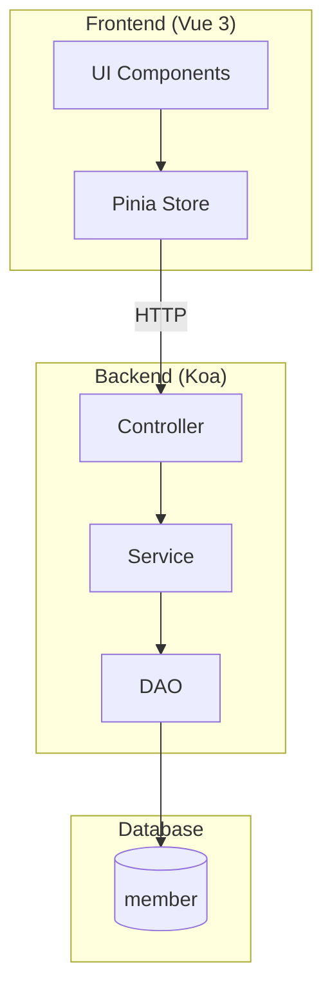

## 데이터 흐름

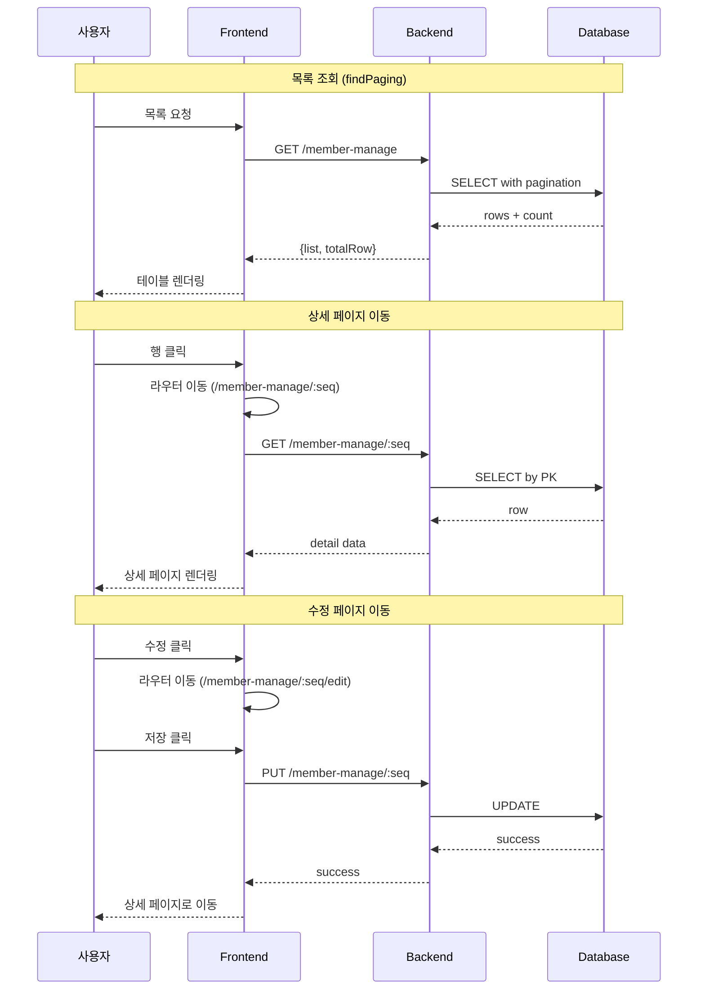

## UI 흐름도

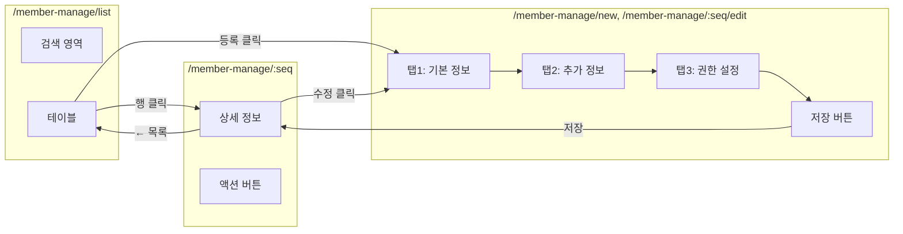

## ER 다이어그램

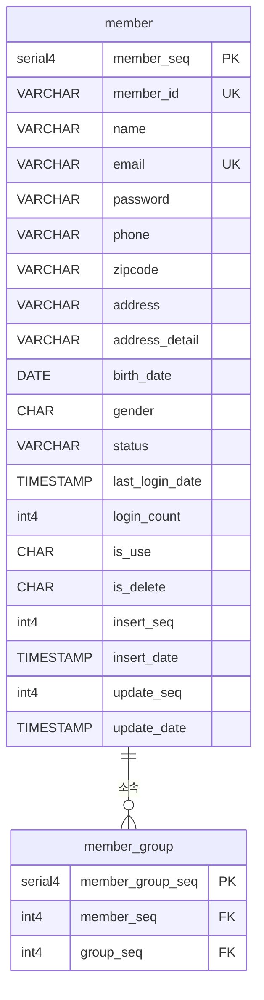

---

# Part B: Detailed Spec (AI용)

## 메타
- 모듈명: member-manage
- 테이블명: member
- 한글 기능명: 회원-관리
- 한줄 설명: 관리자용 회원 정보 관리
- UI 패턴: page (Page 전환)
- 파일 업로드: N
- 저장 방식: -

---

## 1. 기능 범위

### CRUD 기능
| 기능 | 적용 | 메서드명 | 설명 |
|------|------|----------|------|
| 페이징 목록 | Y | findPaging | 페이지네이션 포함 목록 조회 |
| 키워드 검색 | Y | findList | Selectbox용 전체 목록 |
| 상세 조회 | Y | detailOne | 단건 상세 정보 |
| 등록 | Y | insert | 신규 회원 생성 |
| 수정 | Y | update | 회원 정보 수정 |
| 사용여부 변경 | Y | updateUse | 계정 활성화/비활성화 |
| 논리 삭제 | Y | softDelete | 회원 탈퇴 처리 |

### 파일 기능
| 기능 | 적용 |
|------|------|
| 일반 파일 | N |
| 이미지 | N |
| 저장 방식 | - |

---

## 2. UI 구성

### 패턴: Page (페이지 전환)

### 화면 구성
- **목록 페이지** (`/member-manage/list`):
  - 테이블 컬럼: 아이디, 이름, 이메일, 전화번호, 가입일, 상태, 관리
  - 검색 옵션: 키워드, 가입일 범위, 상태 (전체/활성/비활성/탈퇴)
  - 페이지네이션: 50건씩
  - 버튼: [회원 등록]

- **상세 페이지** (`/member-manage/:seq`):
  - 기본 정보: 아이디, 이름, 이메일, 전화번호, 주소
  - 계정 정보: 가입일, 최근 로그인, 로그인 횟수, 상태
  - 권한 정보: 소속 그룹, 권한 목록
  - 버튼: [← 목록] [수정] [탈퇴 처리]

- **등록/수정 페이지** (`/member-manage/new`, `/member-manage/:seq/edit`):
  - 탭 1 - 기본 정보:
    - 아이디 (필수, 4-20자, 영문/숫자)
    - 이름 (필수, 2-50자)
    - 이메일 (필수, 이메일 형식)
    - 전화번호 (010-0000-0000 형식)
  - 탭 2 - 추가 정보:
    - 주소 (우편번호, 기본주소, 상세주소)
    - 생년월일
    - 성별 (남/여)
  - 탭 3 - 권한 설정:
    - 소속 그룹 (다중 선택)
    - 개별 권한 (체크리스트)
    - 상태 (활성/비활성)
  - 버튼: [← 취소] [저장]

- **검증**:
  - 아이디: 필수, 4-20자, 영문/숫자, 중복 확인
  - 이름: 필수, 2-50자
  - 이메일: 필수, 이메일 형식, 중복 확인
  - 전화번호: 010-0000-0000 형식
  - 비밀번호: (신규 등록 시) 필수, 8-20자, 영문+숫자+특수문자

---

## 3. DB 스키마

### 테이블: member

#### PostgreSQL
| 컬럼 | 타입 | 필수 | 설명 | 선택값 | 기본값 |
|------|------|------|------|--------|--------|
| member_seq | serial4 | Y | PK | - | 자동증가 |
| member_id | VARCHAR(20) | Y | 아이디 | - | - |
| name | VARCHAR(50) | Y | 이름 | - | - |
| email | VARCHAR(100) | Y | 이메일 | - | - |
| password | VARCHAR(255) | Y | 비밀번호 (해시) | - | - |
| phone | VARCHAR(20) | N | 전화번호 | - | - |
| zipcode | VARCHAR(10) | N | 우편번호 | - | - |
| address | VARCHAR(200) | N | 기본주소 | - | - |
| address_detail | VARCHAR(200) | N | 상세주소 | - | - |
| birth_date | DATE | N | 생년월일 | - | - |
| gender | CHAR(1) | N | 성별 | M:남,F:여 | - |
| status | VARCHAR(20) | Y | 상태 | ACTIVE,INACTIVE,WITHDRAWN | ACTIVE |
| last_login_date | TIMESTAMP | N | 최근 로그인 | - | - |
| login_count | int4 | Y | 로그인 횟수 | - | 0 |
| is_use | CHAR(1) | Y | 사용여부 | Y:사용,N:미사용 | Y |
| is_delete | CHAR(1) | Y | 삭제여부 | Y:삭제,N:정상 | N |
| insert_seq | int4 | Y | 등록자 | - | - |
| insert_date | TIMESTAMP | Y | 등록일 | - | - |
| update_seq | int4 | Y | 수정자 | - | - |
| update_date | TIMESTAMP | Y | 수정일 | - | - |

#### MySQL
| 컬럼 | 타입 | 필수 | 설명 | 선택값 | 기본값 |
|------|------|------|------|--------|--------|
| member_seq | BIGINT | Y | PK | - | AUTO_INCREMENT |
| member_id | VARCHAR(20) | Y | 아이디 | - | - |
| name | VARCHAR(50) | Y | 이름 | - | - |
| email | VARCHAR(100) | Y | 이메일 | - | - |
| password | VARCHAR(255) | Y | 비밀번호 (해시) | - | - |
| phone | VARCHAR(20) | N | 전화번호 | - | - |
| zipcode | VARCHAR(10) | N | 우편번호 | - | - |
| address | VARCHAR(200) | N | 기본주소 | - | - |
| address_detail | VARCHAR(200) | N | 상세주소 | - | - |
| birth_date | DATE | N | 생년월일 | - | - |
| gender | CHAR(1) | N | 성별 | M:남,F:여 | - |
| status | VARCHAR(20) | Y | 상태 | ACTIVE,INACTIVE,WITHDRAWN | ACTIVE |
| last_login_date | DATETIME | N | 최근 로그인 | - | - |
| login_count | INT | Y | 로그인 횟수 | - | 0 |
| is_use | CHAR(1) | Y | 사용여부 | Y:사용,N:미사용 | Y |
| is_delete | CHAR(1) | Y | 삭제여부 | Y:삭제,N:정상 | N |
| insert_seq | BIGINT | Y | 등록자 | - | - |
| insert_date | DATETIME | Y | 등록일 | - | - |
| update_seq | BIGINT | Y | 수정자 | - | - |
| update_date | DATETIME | Y | 수정일 | - | - |

### 인덱스
```sql
UNIQUE INDEX idx_member_id (member_id, is_delete)
UNIQUE INDEX idx_email (email, is_delete)
INDEX idx_status (status, insert_date DESC)
```

### 참조 관계 (FK 생성 안함)
- insert_seq → member.member_seq (등록자, self-reference)
- update_seq → member.member_seq (수정자, self-reference)
- member_group 테이블로 그룹 다대다 관계

---

## 4. 파일 목록

### Backend
```
api/src/modules/member-manage/
├── type/
│   └── member-manage.type.ts
├── dao/
│   └── member-manage.dao.ts
├── service/
│   ├── member-manage.service.ts
│   └── member-manage-tdd.service.ts
├── controller/
│   ├── member-manage.validator.ts
│   └── member-manage.controller.ts
└── test/
    └── member-manage.test.ts
```

### Frontend
```
front/src/modules/member-manage/
├── type/
│   └── member-manage.type.ts
├── store/
│   └── member-manage.store.ts
├── pages/
│   ├── list.vue
│   ├── detail.vue
│   ├── form.vue
│   ├── list-search.vue
│   └── list-table.vue
└── test/
    └── member-manage.test.ts (선택)
```

---

## 5. 참조
- 가이드 코드:
  - Backend: `api/src/modules/test-data/`
  - Frontend: `front/src/modules/test-data/pages/crud/` (detail-page.vue 포함)
- UI 패턴: [ui-patterns.md](ui-patterns.md) - Page 패턴 참조
- CRUD 기능: [crud-operations.md](crud-operations.md) 참조

---
---

# 예제 3: 제품 관리

> 제품 정보 관리 (Excel 업로드/다운로드)

---

# Part A: Visual Overview (사람용)

## 시스템 아키텍처

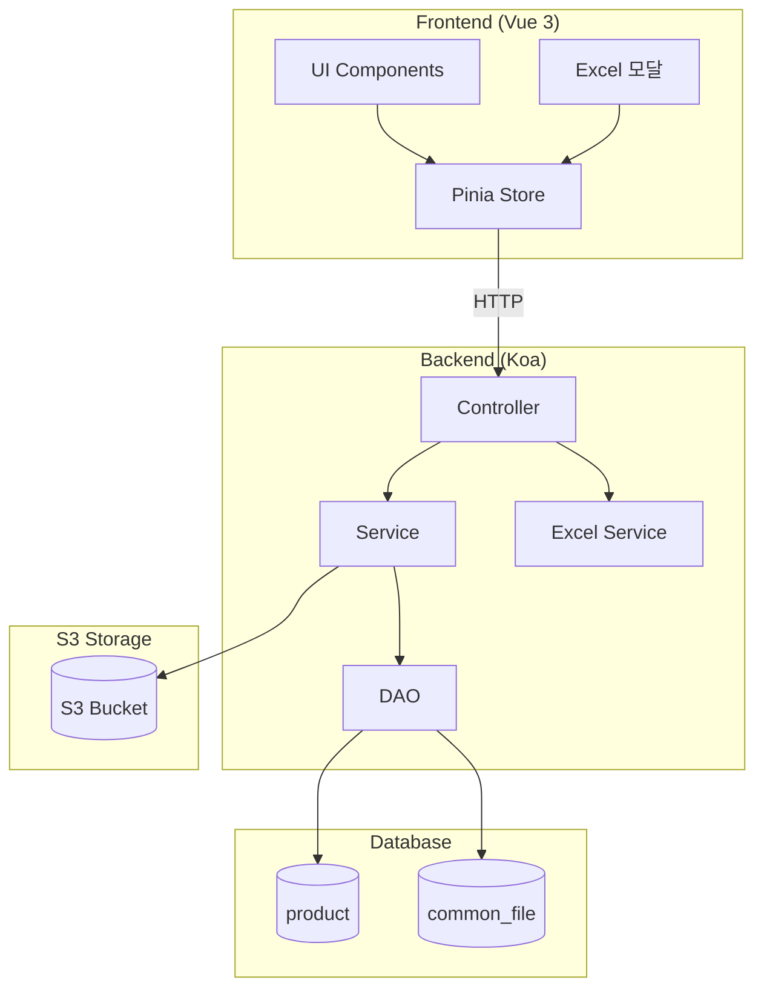

## 데이터 흐름

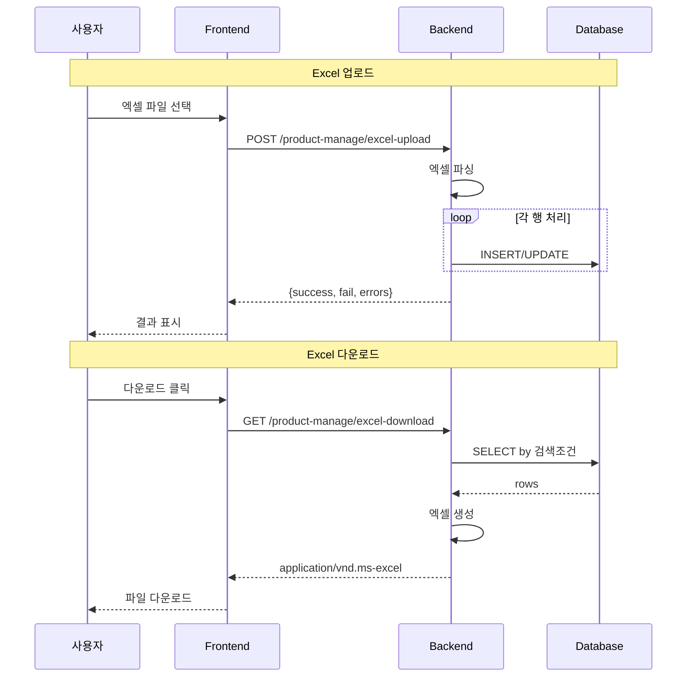

## UI 흐름도

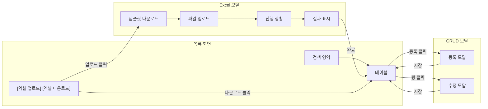

## ER 다이어그램

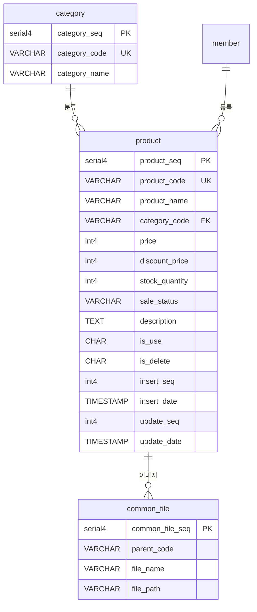

---

# Part B: Detailed Spec (AI용)

## 메타
- 모듈명: product-manage
- 테이블명: product
- 한글 기능명: 제품-관리
- 한줄 설명: 제품 정보 관리 및 대량 업로드
- UI 패턴: crud (Modal) + excel
- 파일 업로드: Y (이미지만)
- 저장 방식: S3

---

## 1. 기능 범위

### CRUD 기능
| 기능 | 적용 | 메서드명 | 설명 |
|------|------|----------|------|
| 페이징 목록 | Y | findPaging | 페이지네이션 포함 목록 조회 |
| 키워드 검색 | Y | findList | Selectbox용 전체 목록 |
| 상세 조회 | Y | detailOne | 단건 상세 정보 + 이미지 목록 |
| 등록 | Y | insert | 신규 제품 생성 + 이미지 연결 |
| 수정 | Y | update | 제품 정보 수정 + 이미지 재연결 |
| 사용여부 변경 | Y | updateUse | 판매 활성화/비활성화 |
| 논리 삭제 | Y | softDelete | 제품 삭제 처리 + 이미지 삭제 |

### 파일 기능
| 기능 | 적용 |
|------|------|
| 일반 파일 | N |
| 이미지 | Y |
| 저장 방식 | S3 |

### Excel 기능
| 기능 | 적용 | 메서드명 | 설명 |
|------|------|----------|------|
| Excel 업로드 | Y | excelUpload | 대량 제품 데이터 업로드 |
| Excel 다운로드 | Y | excelDownload | 현재 검색 조건의 제품 다운로드 |
| 템플릿 다운로드 | Y | excelTemplate | 업로드용 빈 템플릿 제공 |

---

## 2. UI 구성

### 패턴: 기본 CRUD (Modal) + Excel

### 화면 구성
- **목록 화면**:
  - 테이블 컬럼: 썸네일, 제품코드, 제품명, 카테고리, 가격, 재고, 판매상태, 관리
  - 검색 옵션: 키워드, 카테고리, 가격 범위, 판매상태
  - 페이지네이션: 30건씩
  - 버튼: [등록] [엑셀 업로드] [엑셀 다운로드]

- **등록/수정 모달**:
  - 제품코드 (필수, 20자 이내, 영문/숫자)
  - 제품명 (필수, 100자 이내)
  - 카테고리 (필수, Selectbox)
  - 가격 (필수, 숫자, 0 이상)
  - 할인가 (선택, 숫자, 0 이상)
  - 재고 수량 (필수, 숫자, 0 이상)
  - 판매 상태 (판매중/품절/단종)
  - 제품 설명 (Textarea)
  - 이미지 (다중, 최대 5개, 첫 번째 이미지가 썸네일)
  - 버튼: [취소] [저장]

- **Excel 업로드 모달**:
  - 1단계: [템플릿 다운로드] 버튼
  - 2단계: 파일 선택 (*.xlsx, *.xls)
  - 3단계: [업로드 시작] 버튼
  - 진행 상황: 프로그레스 바 (처리 건수/전체 건수)
  - 결과: 성공 건수, 실패 건수, 에러 로그 다운로드

- **검증**:
  - 제품코드: 필수, 20자 이내, 영문/숫자, 중복 확인
  - 제품명: 필수, 100자 이내
  - 카테고리: 필수
  - 가격: 필수, 0 이상
  - 재고 수량: 필수, 0 이상

---

## 3. DB 스키마

### 테이블: product

#### PostgreSQL
| 컬럼 | 타입 | 필수 | 설명 | 선택값 | 기본값 |
|------|------|------|------|--------|--------|
| product_seq | serial4 | Y | PK | - | 자동증가 |
| product_code | VARCHAR(20) | Y | 제품코드 | - | - |
| product_name | VARCHAR(100) | Y | 제품명 | - | - |
| category_code | VARCHAR(20) | Y | 카테고리 코드 | - | - |
| price | int4 | Y | 가격 | - | 0 |
| discount_price | int4 | N | 할인가 | - | NULL |
| stock_quantity | int4 | Y | 재고 수량 | - | 0 |
| sale_status | VARCHAR(20) | Y | 판매 상태 | ON_SALE,SOLD_OUT,DISCONTINUED | ON_SALE |
| description | TEXT | N | 제품 설명 | - | - |
| is_use | CHAR(1) | Y | 사용여부 | Y:사용,N:미사용 | Y |
| is_delete | CHAR(1) | Y | 삭제여부 | Y:삭제,N:정상 | N |
| insert_seq | int4 | Y | 등록자 | - | - |
| insert_date | TIMESTAMP | Y | 등록일 | - | - |
| update_seq | int4 | Y | 수정자 | - | - |
| update_date | TIMESTAMP | Y | 수정일 | - | - |

#### MySQL
| 컬럼 | 타입 | 필수 | 설명 | 선택값 | 기본값 |
|------|------|------|------|--------|--------|
| product_seq | BIGINT | Y | PK | - | AUTO_INCREMENT |
| product_code | VARCHAR(20) | Y | 제품코드 | - | - |
| product_name | VARCHAR(100) | Y | 제품명 | - | - |
| category_code | VARCHAR(20) | Y | 카테고리 코드 | - | - |
| price | INT | Y | 가격 | - | 0 |
| discount_price | INT | N | 할인가 | - | NULL |
| stock_quantity | INT | Y | 재고 수량 | - | 0 |
| sale_status | VARCHAR(20) | Y | 판매 상태 | ON_SALE,SOLD_OUT,DISCONTINUED | ON_SALE |
| description | TEXT | N | 제품 설명 | - | - |
| is_use | CHAR(1) | Y | 사용여부 | Y:사용,N:미사용 | Y |
| is_delete | CHAR(1) | Y | 삭제여부 | Y:삭제,N:정상 | N |
| insert_seq | BIGINT | Y | 등록자 | - | - |
| insert_date | DATETIME | Y | 등록일 | - | - |
| update_seq | BIGINT | Y | 수정자 | - | - |
| update_date | DATETIME | Y | 수정일 | - | - |

### 인덱스
```sql
UNIQUE INDEX idx_product_code (product_code, is_delete)
INDEX idx_category (category_code, sale_status, is_delete)
INDEX idx_price (price, is_delete)
```

### 참조 관계 (FK 생성 안함)
- category_code → category.category_code (카테고리)
- insert_seq → member.member_seq (등록자)
- update_seq → member.member_seq (수정자)
- 이미지: common_file.parent_code = `product-{product_seq}-image`

---

## 4. 파일 목록

### Backend
```
api/src/modules/product-manage/
├── type/
│   └── product-manage.type.ts
├── dao/
│   └── product-manage.dao.ts
├── service/
│   ├── product-manage.service.ts
│   ├── product-manage-tdd.service.ts
│   └── product-manage-excel.service.ts  # Excel 전용
├── controller/
│   ├── product-manage.validator.ts
│   └── product-manage.controller.ts
└── test/
    ├── product-manage.test.ts
    └── product-manage-excel.test.ts
```

### Frontend
```
front/src/modules/product-manage/
├── type/
│   └── product-manage.type.ts
├── store/
│   └── product-manage.store.ts
├── pages/
│   ├── list.vue
│   ├── list-search.vue
│   └── list-table.vue
├── modals/
│   ├── insert.modal.vue
│   ├── update.modal.vue
│   └── excel-upload.modal.vue
└── test/
    └── product-manage.test.ts (선택)
```

---

## 5. Excel 상세 명세

### Excel 템플릿 구조

| 컬럼명 | 필수 | 타입 | 설명 | 예제 |
|--------|------|------|------|------|
| 제품코드 | Y | 문자 | 20자 이내, 영문/숫자 | PROD001 |
| 제품명 | Y | 문자 | 100자 이내 | 노트북 A |
| 카테고리 | Y | 문자 | 카테고리 코드 | ELEC |
| 가격 | Y | 숫자 | 0 이상 | 1500000 |
| 할인가 | N | 숫자 | 0 이상 | 1200000 |
| 재고 수량 | Y | 숫자 | 0 이상 | 50 |
| 판매 상태 | Y | 문자 | ON_SALE,SOLD_OUT,DISCONTINUED | ON_SALE |
| 제품 설명 | N | 문자 | - | 고성능 노트북 |

### Backend Excel API

```typescript
// Excel 업로드
POST /product-manage/excel-upload
- Content-Type: multipart/form-data
- Body: { file: File }
- Response: {
    success: number,
    fail: number,
    errors: Array<{ row: number, message: string }>
  }

// Excel 다운로드
GET /product-manage/excel-download
- Query: 검색 조건 (목록과 동일)
- Response: application/vnd.ms-excel

// 템플릿 다운로드
GET /product-manage/excel-template
- Response: application/vnd.ms-excel (빈 템플릿)
```

---

## 6. 참조
- 가이드 코드:
  - Backend: `api/src/modules/test-data/`
  - Frontend: `front/src/modules/test-data/pages/crud-excel/`
- Excel 패턴: [ui-patterns.md](ui-patterns.md) - Excel 패턴 참조
- 파일 업로드: [file-upload.md](file-upload.md) 참조
- CRUD 기능: [crud-operations.md](crud-operations.md) 참조

---
---

# 요약

## 3가지 예제 비교

| 항목 | 공지사항 게시판 | 회원 관리 | 제품 관리 |
|------|----------------|-----------|-----------|
| UI 패턴 | crud (Modal) | page (Page) | crud + excel |
| 파일 업로드 | 일반 + 이미지 | 없음 | 이미지만 |
| 저장 방식 | Local | - | S3 |
| 특징 | 기본 CRUD | 복잡한 폼 (탭) | 대량 업로드 |
| 적합 사례 | 게시판, FAQ | 회원, 설정 | 상품, 주문 |

## 패턴 선택 가이드

1. **기본 CRUD 필요** → 공지사항 게시판 예제 참조
2. **복잡한 폼 (10개 이상 필드, 탭)** → 회원 관리 예제 참조
3. **대량 데이터 입출력** → 제품 관리 예제 참조
4. **파일 업로드 포함** → 공지사항 게시판 또는 제품 관리 예제 참조

## 공통 원칙

- **테이블명**: snake_case
- **모듈명**: kebab-case
- **타입/클래스**: PascalCase
- **공통 컬럼**: is_use, is_delete, insert_seq, insert_date, update_seq, update_date
- **FK 제약조건**: 생성하지 않음 (명시만)
- **가이드 코드**: test-data 모듈 패턴 강력 준수
- **하이브리드 구조**: Part A(시각화) + Part B(상세 명세)
